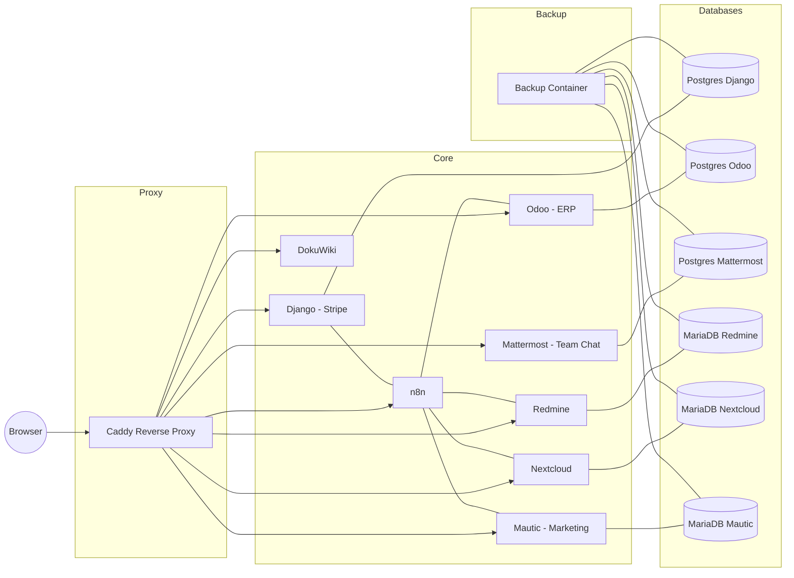

# ☁️ Cloudetta — Open Business Cloud Toolkit

**by [Antonio Trento](https://antoniotrento.net)**
*An open-source integrated business cloud stack for SaaS and SMEs.*

<p align="center">
  <a href="https://github.com/cloudetta/cloudetta"></a>
  <a href="https://github.com/antoniotrento/cloudetta/blob/main/LICENSE.md"></a>
  <a href="https://www.docker.com/"></a>
  <a href="https://www.python.org/"></a>
  <a href="https://www.odoo.com/"></a>
  <a href="https://www.mautic.org/"></a>
  <a href="https://mattermost.com/"></a>
  <a href="https://n8n.io/"></a>
  <a href="https://antoniotrento.net"></a>
</p>

---

## 🌍 Overview

**Cloudetta** is an **open-source modular stack** designed for small-to-medium businesses, system integrators, and SaaS builders.
It bundles **Django (Stripe)**, **Odoo (ERP + Italian invoicing)**, **Nextcloud**, **Redmine**, **DokuWiki**, **n8n**, **Mautic (Marketing Automation)**, **Mattermost (Team Chat)** and **Caddy** — all orchestrated via Docker Compose, with prebuilt integrations and daily backups.

> 🇮🇹 Cloudetta è uno **stack open-source integrato** per PMI e startup.
> Include Django (Stripe), Odoo (ERP + Fatturazione Elettronica Italia), Nextcloud, Redmine, DokuWiki, n8n, **Mautic (marketing)**, **Mattermost (chat)** e Caddy — tutto in container, con integrazioni API e backup automatici.

---

## 🧩 Components

| Service              | Description                   | Default URL (prod)              |
| -------------------- | ----------------------------- | ------------------------------- |
| **Django + Stripe**  | Subscription & API management | `https://django.example.com`    |
| **Odoo**             | ERP, invoicing (l10n_it_edi)  | `https://odoo.example.com`      |
| **Nextcloud**        | Files, shares, backups        | `https://nextcloud.example.com` |
| **Redmine**          | Ticketing & projects          | `https://redmine.example.com`   |
| **DokuWiki**         | Knowledge base                | `https://wiki.example.com`      |
| **n8n**              | Workflow automation           | `https://n8n.example.com`       |
| **Mautic**           | Marketing automation & email  | `https://mautic.example.com`    |
| **Mattermost**       | Team chat (Slack-like)        | `https://chat.example.com`      |
| **Caddy**            | Reverse proxy & SSL           | —                               |
| **Backup container** | Nightly dumps & archives      | `/backups/`                     |

> In locale (sviluppo), gli host sono `*.localhost` (es: `http://django.localhost`, `http://mautic.localhost`, `http://chat.localhost`).

---

## 🚀 Quick Start

### 🇮🇹 Installazione

```bash
git clone https://github.com/antoniotrento/cloudetta.git
cd cloudetta
cp .env.example .env
# Modifica .env:
# ADMIN_USER=admin
# ADMIN_PASS=ChangeMe!123
# ADMIN_EMAIL=antonio.trento@yahoo.com
```

Poi esegui:

```bash
sed -i 's/\r$//' .env
sed -i 's/\r$//' bootstrap_cloudetta.sh
sed -i 's/\r$//' install.sh
chmod +x bootstrap_cloudetta.sh
chmod +x install.sh
```
Poi per montarlo:

```bash
./bootstrap_cloudetta.sh
```

### 🇬🇧 Installation

```bash
git clone https://github.com/antoniotrento/cloudetta.git
cd cloudetta
cp .env.example .env
# Edit .env:
# Modifica .env:
# ADMIN_USER=admin
# ADMIN_PASS=ChangeMe!123
# ADMIN_EMAIL=antonio.trento@yahoo.com
```

Then:

```bash
sed -i 's/\r$//' .env
sed -i 's/\r$//' bootstrap_cloudetta.sh
sed -i 's/\r$//' install.sh
chmod +x bootstrap_cloudetta.sh
chmod +x install.sh
```

Then (if included):

```bash
./bootstrap_cloudetta.sh
```

✅ Services (prod domains if configured in `.env`):

```
https://django.example.com
https://odoo.example.com
https://nextcloud.example.com
```bash
./setup_api_links.sh
```

✅ Services (prod domains if configured in `.env`):

```
https://django.example.com
https://odoo.example.com
https://nextcloud.example.com
https://redmine.example.com
https://wiki.example.com
https://n8n.example.com
https://mautic.example.com
https://chat.example.com
```

Locale (sviluppo) via Caddy:

```
http://django.localhost
http://odoo.localhost
http://nextcloud.localhost
http://redmine.localhost
http://wiki.localhost
http://n8n.localhost
http://mautic.localhost
http://chat.localhost
```

---

## ⚙️ Configuration

Le variabili principali (tutte in `.env`):

| Variable                                                                                                                                | Description                                                                                                                   |
| --------------------------------------------------------------------------------------------------------------------------------------- | ----------------------------------------------------------------------------------------------------------------------------- |
| `ADMIN_USER` / `ADMIN_PASS` / `ADMIN_EMAIL`                                                                                             | **Unificato**: propagato su Django, Nextcloud, Redmine, Odoo (DB admin), n8n (BasicAuth), Mautic (admin), Mattermost (admin). |
| `DJANGO_SECRET_KEY`, `DJANGO_DEBUG`, `DJANGO_ALLOWED_HOSTS`, `DJANGO_CSRF_TRUSTED_ORIGINS`                                              | Django settings.                                                                                                              |
| `STRIPE_SECRET_KEY`, `STRIPE_WEBHOOK_SECRET`                                                                                            | Stripe integration.                                                                                                           |
| `ODOO_DB_PASSWORD`, `ODOO_DB`, `ODOO_MASTER_PASSWORD`, `ODOO_DEMO`, `ODOO_LANG`                                                         | Odoo + auto-DB create.                                                                                                        |
| `NEXTCLOUD_DB_PASSWORD`, `NEXTCLOUD_ROOT_PW`, `NEXTCLOUD_ADMIN_USER`, `NEXTCLOUD_ADMIN_PASS`, `TRUSTED_DOMAINS`                         | Nextcloud install.                                                                                                            |
| `REDMINE_DB_PASSWORD`, `REDMINE_ROOT_PW`, `REDMINE_SECRET_KEY_BASE`                                                                     | Redmine + secret.                                                                                                             |
| `MAIL_PROVIDER` (`sendgrid` | `mailcow` | `smtp`)                                                                                       | Global outgoing mail container.                                                                                               |
| `MAIL_USER`, `MAIL_PASS`, (`MAIL_HOST`,`MAIL_PORT`,`MAIL_ENCRYPTION` se `smtp`)                                                         | Mail credentials (es. Yahoo SMTP).                                                                                            |
| `N8N_PASSWORD` (o `ADMIN_PASS`)                                                                                                         | n8n BasicAuth.                                                                                                                |
| `MAUTIC_DB_HOST`/`NAME`/`USER`/`PASSWORD`/`PORT`, `MAUTIC_ROOT_PW`, `MAUTIC_DOMAIN`                                                     | Mautic DB & site URL.                                                                                                         |
| `MATTERMOST_SITEURL`, `MATTERMOST_ADMIN_USER`/`EMAIL`/`PASS`, `MATTERMOST_TEAM_NAME`/`DISPLAY`                                          | Mattermost site URL + admin + team.                                                                                           |
| `DJANGO_DOMAIN`, `ODOO_DOMAIN`, `NEXTCLOUD_DOMAIN`, `REDMINE_DOMAIN`, `WIKI_DOMAIN`, `N8N_DOMAIN`, `MAUTIC_DOMAIN`, `MATTERMOST_DOMAIN` | Domini pubblici per Caddy/HTTPS.                                                                                              |

> **Yahoo SMTP (esempio)**
>
> ```
> MAIL_PROVIDER=smtp
> MAIL_USER=tuoutente@yahoo.com
> MAIL_PASS=app_password_generata
> MAIL_HOST=smtp.mail.yahoo.com
> MAIL_PORT=587
> MAIL_ENCRYPTION=tls
> MAIL_FROM_NAME="Tuo Nome"
> MAIL_FROM_ADDRESS=tuoutente@yahoo.com
> ```

---

## 🧠 Architecture

### Mermaid Diagram



---

## 🔗 Integrations

### 🇮🇹 Flussi principali

* **Django → Redmine:** ticket da ordini / errori pagamento.
* **Django → Nextcloud:** upload automatico fatture PDF.
* **Odoo → Django:** sync clienti/prodotti/listini.
* **Mautic ↔ n8n:** invio campagne, webhook, segmentazioni dinamiche.
* **Mattermost:** notifiche operative (via n8n) su canali/teams.
* **Backup container:** dump DB + archivi volumi h 02:00.

### 🇬🇧 Main Flows

* **Django → Redmine:** tickets from orders/failures.
* **Django → Nextcloud:** auto-upload invoices PDFs.
* **Odoo → Django:** two-way sync customers/products.
* **Mautic ↔ n8n:** campaigns, webhooks, dynamic segments.
* **Mattermost:** ops notifications (via n8n) to channels/teams.
* **Backup container:** daily DB + volume backup at 02:00 UTC.

---

## 🔒 Backup & Restore

### 🇮🇹 Backup

* Esegue nel container `backup` (cron 02:00).
* Salva:

  * Dump di tutti i DB (Postgres + MariaDB)
  * Archivi tar.gz dei volumi Docker
  * Immagini custom (`docker save`)

Esecuzione manuale:

```bash
docker exec -it backup /backup/backup.sh
```

### 🇬🇧 Backup

* Automated `backup` container runs daily at 02:00.
* Includes:

  * Full DB dumps (Postgres + MariaDB)
  * Volume archives (tar.gz)
  * Custom images (`docker save`)

Manual run:

```bash
docker exec -it backup /backup/backup.sh
```

---

## 🧰 Usage

### Django (SaaS / Stripe)

* Subscriptions, customers, API keys
* Stripe webhook listener
* Admin reporting

### Odoo (ERP / Fatturazione)

* `l10n_it`, `l10n_it_edi` per Fatturazione Elettronica
* PEC/SDI integration ready
* Sync con Django (n8n)

### Nextcloud

* Archivio documenti (fatture, contratti)
* Client web/desktop/mobile
* Flussi automazione via n8n

### Redmine

* Issue tracking, SLA, progetti
* Ticket automatici da eventi

### Mautic (Marketing Automation)

* Campagne email, segmenti, lead scoring
* Integrazione SMTP (es. Yahoo, Sendgrid)
* Webhook e automazioni via n8n

### Mattermost (Team Chat)

* Canali, team, mention e integrazioni
* Notifiche da n8n/servizi interni
* Admin/Team creati dal bootstrap

### n8n

* Workflow visuale
* REST, webhook, connettori multipli
* Flussi preconfigurati

### DokuWiki

* KB interna, SOP
* Semplice e versionabile

---

## 💼 Consulting & Support

> **Cloudetta** is open-source — but if you need help deploying or customizing it:

**Premium Services by [Antonio Trento](https://antoniotrento.net)**

* Installazione e hardening (on-prem / VPS / cloud)
* Domini, SSL e Cloudflare Tunnel
* Integrazione SDI / PEC per Odoo
* Branding personalizzato
* Training e supporto con SLA

📧 **Contact:** [info@antoniotrento.net](mailto:info@antoniotrento.net)

---

## 🧾 License

**MIT License** — © 2025 [Antonio Trento](https://antoniotrento.net)
Use freely for personal and commercial projects. Attribution appreciated.

---

## ⭐ Support & Community

If you find **Cloudetta** useful:

* Leave a ⭐ on GitHub
* Share it with your team
* Contribute docs, issues or PRs

> *Empowering small businesses with open-source cloud automation.*
