# ☁️ Cloudetta — Open Business Cloud Toolkit  
**by [Antonio Trento](https://antoniotrento.net)**  
*An open-source integrated business cloud stack for SaaS and SMEs.*

<p align="center">
  <a href="https://github.com/cloudetta/cloudetta"></a>
  <a href="https://github.com/antoniotrento/cloudetta/blob/main/LICENSE.md"></a>
  <a href="https://www.docker.com/"></a>
  <a href="https://www.python.org/"></a>
  <a href="https://www.odoo.com/"></a>
  <a href="https://n8n.io/"></a>
  <a href="https://antoniotrento.net"></a>
</p>

---

## 🌍 Overview

**Cloudetta** is an **open-source modular stack** designed for small-to-medium businesses, system integrators, and SaaS builders.  
It bundles **Django (Stripe)**, **Odoo (ERP + Italian invoicing)**, **Nextcloud**, **Redmine**, **DokuWiki**, **n8n**, and **Caddy** — all orchestrated via Docker Compose, with prebuilt integrations and daily backups.

> 🇮🇹 Cloudetta è uno **stack open-source integrato** per PMI e startup.  
> Include Django (Stripe), Odoo (ERP + Fatturazione Elettronica Italia), Nextcloud, Redmine, DokuWiki, n8n e Caddy — tutto gestito in container, con integrazioni API e backup automatici.

---

## 🧩 Components

| Service | Description | Default URL |
|----------|--------------|-------------|
| **Django + Stripe** | Subscription and API management | `https://django.example.com` |
| **Odoo** | ERP, invoicing (with SDI/PEC, l10n_it_edi) | `https://odoo.example.com` |
| **Nextcloud** | File management, customer docs, backups | `https://nextcloud.example.com` |
| **Redmine** | Ticketing, project management, SLA tracking | `https://redmine.example.com` |
| **DokuWiki** | Internal knowledge base | `https://wiki.example.com` |
| **n8n** | Workflow automation and API orchestration | `https://n8n.example.com` |
| **Caddy** | Reverse proxy, SSL, Cloudflare Tunnel compatible | `https://caddy.example.com` |
| **Backup container** | Scheduled DB and volume backups | `/backups/` |

---

## 🚀 Quick Start

### 🇮🇹 Installazione
```bash
git clone https://github.com/antoniotrento/cloudetta.git
cd cloudetta
cp .env.example .env
# Configura le chiavi e le password (Stripe, DB, Mail, ecc.)
chmod +x install.sh
````

Poi esegui:
```bash
cd scripts
chmod +x bootstrap_cloudetta.sh
./bootstrap_cloudetta.sh
```

Poi esegui:

```bash
cd integration
chmod +x setup_api_links.sh
./setup_api_links.sh
```


### 🇬🇧 Installation

```bash
git clone https://github.com/antoniotrento/cloudetta.git
cd cloudetta
cp .env.example .env
# Set all keys and passwords (Stripe, DB, Mail, etc.)
chmod +x install.sh && ./install.sh
```

Then:
```bash
cd scripts
chmod +x bootstrap_cloudetta.sh
./bootstrap_cloudetta.sh
```

Then:

```bash
cd integration
chmod +x setup_api_links.sh
./setup_api_links.sh
```

✅ All services will be available on:

```
https://django.example.com
https://odoo.example.com
https://nextcloud.example.com
https://redmine.example.com
https://wiki.example.com
https://n8n.example.com
```

---

## ⚙️ Configuration

| Variable                                        | Description                 |
| ----------------------------------------------- | --------------------------- |
| `DJANGO_SECRET_KEY`                             | Django secret key           |
| `STRIPE_SECRET_KEY` / `STRIPE_WEBHOOK_SECRET`   | Stripe integration          |
| `ODOO_DB_PASSWORD`                              | Odoo Postgres password      |
| `NEXTCLOUD_DB_PASSWORD` / `REDMINE_DB_PASSWORD` | MariaDB credentials         |
| `MAIL_PROVIDER`                                 | sendgrid \| mailcow \| smtp |
| `MAIL_USER` / `MAIL_PASS`                       | Email credentials           |
| `N8N_PASSWORD`                                  | Admin password for n8n      |
| `DJANGO_ALLOWED_HOSTS`                          | Comma-separated domain list |

---

## 🧠 Architecture

### Mermaid Diagram

```mermaid
flowchart LR
  subgraph Proxy
    Caddy[Caddy Reverse Proxy];
  end

  subgraph Core
    Django[Django – Stripe];
    Odoo[Odoo – ERP];
    Nextcloud[Nextcloud];
    Redmine[Redmine];
    DokuWiki[DokuWiki];
    N8N[n8n];
  end

  subgraph Databases
    PGD[(Postgres Django)];
    PGO[(Postgres Odoo)];
    MR[(MariaDB Redmine)];
    MN[(MariaDB Nextcloud)];
  end

  subgraph Backup
    B[Backup Container];
  end

  Client((Browser)) --> Caddy;
  Caddy --> Django;
  Caddy --> Odoo;
  Caddy --> Nextcloud;
  Caddy --> Redmine;
  Caddy --> DokuWiki;
  Caddy --> N8N;

  Django --- N8N;
  N8N --- Odoo;
  N8N --- Nextcloud;
  N8N --- Redmine;

  Django --- PGD;
  Odoo --- PGO;
  Redmine --- MR;
  Nextcloud --- MN;

  B --- PGD;
  B --- PGO;
  B --- MR;
  B --- MN;

```



---

## 🔗 Integrations

### 🇮🇹 Flussi principali

* **Django → Redmine:** genera ticket da ordini o errori pagamento.
* **Django → Nextcloud:** carica automaticamente le fatture PDF.
* **Odoo → Django:** sincronizza clienti/prodotti e listini.
* **n8n:** gestisce automazioni e webhook tra tutti i servizi.
* **Backup container:** salva DB e volumi ogni notte (cron h 02:00).

### 🇬🇧 Main Flows

* **Django → Redmine:** create tickets from new orders or failed payments.
* **Django → Nextcloud:** upload invoice PDFs automatically.
* **Odoo → Django:** sync customers/products and pricelists.
* **n8n:** orchestrates API integrations and workflows.
* **Backup container:** daily DB + volume backup at 02:00 UTC.

---

## 🔒 Backup & Restore

### 🇮🇹 Backup

* Avviene automaticamente nel container `backup` (cron 02:00).
* Salva:

  * Dump di tutti i DB (Postgres + MariaDB)
  * Archivi tar.gz dei volumi Docker
  * Immagini custom (`docker save`)

Ripristino manuale:

```bash
docker exec -it backup /backup/backup.sh
```

### 🇬🇧 Backup

* Automated `backup` container runs daily at 02:00.
* Includes:

  * Full DB dumps
  * Volume archives
  * Custom image saves (`docker save`)

Manual run:

```bash
docker exec -it backup /backup/backup.sh
```

---

## 🧰 Usage

### Django (SaaS / Stripe)

* Manage subscriptions, customers, and API access
* Integrated Stripe webhook listener
* Admin dashboard for payment history

### Odoo (ERP / Fatturazione)

* `l10n_it`, `l10n_it_edi` modules for Italian e-invoicing
* PEC/SDI configuration preloaded
* Two-way sync with Django

### Nextcloud

* Centralized file repository (invoices, contracts, docs)
* Web, desktop, or mobile access
* Auto-sync via n8n workflows

### Redmine

* Issue tracking, SLA monitoring
* Automatic ticket creation from events
* Integrated project templates

### n8n

* Visual workflow builder for automation
* REST + webhook integration with Django & Odoo
* Predefined flows for billing and CRM

### DokuWiki

* Markdown-compatible internal knowledge base
* Ideal for IT documentation and SOPs

---

## 💼 Consulting & Support

> **Cloudetta** is open-source — but if you need help deploying or customizing it:

**Premium Services by [Antonio Trento](https://antoniotrento.net)**

* Installazione e hardening (on-prem / VPS / cloud)
* Setup domini, SSL e Cloudflare Tunnel
* Integrazione SDI / PEC per Odoo
* Branding personalizzato
* Training team e supporto SLA

📧 **Contact:** [info@antoniotrento.net](mailto:info@antoniotrento.net)

---

## 🧾 License

**MIT License** — © 2025 [Antonio Trento](https://antoniotrento.net)

Use freely for personal and commercial projects. Attribution appreciated.

---

## ⭐ Support & Community

If you find **Cloudetta** useful:

* Leave a ⭐ on [GitHub](https://github.com/antoniotrento/cloudetta)
* Share it with your team
* Contribute with docs, bug reports or improvements

> *Empowering small businesses with open-source cloud automation.*


